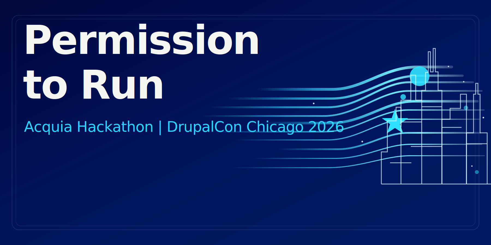

  

# Permission to Run
## The Agent Experience (AX) Build Sprint for Drupal

Build with any agent. Let Drupal be the governor.

Permission to Run is what happens when agents can move at full speed and Drupal keeps outcomes safe, reviewable, and repeatable through permissions, workflow, schema, diffs, and auditability.

## Why this exists

We are designing Drupal for **principals**: humans, agents, and hybrids.

That means giving agents enough context, validation, and guidance to do useful work without magic backdoors or one-off exceptions. When we improve Agent Experience (AX), we improve Drupal for everyone.

## Core rule

Build something with **any agent**.

Use:
- Drupal's built-in agent/chat interface
- your own agent workflow
- Cursor, Claude Code, Codex, custom agents, MCP/JSON:API/CLI tooling
- a team of agents

Tool-agnostic is the point.

## What to build

Your project should make agent work safer, more accountable, or more repeatable in Drupal.

Examples:
- agent drafts content safely using revisions, moderation, or workspaces
- agent proposes config changes as reviewable diffs
- safe site-ops tool boundaries with batching, rollback, and audit logs
- one-interface patterns that reduce module-by-module UI discovery
- validators, runbooks, and guardrails that improve first-pass success

## AX principles

### 1. Parity with human safety
Agents operate inside the same frameworks humans use:
- permissions
- schema validation
- workflows
- revisions
- config diffs

No magic backdoors.

### 2. Guidance over giant new features
Prefer:
- context files
- instructions
- templates
- validators
- checks
- small guardrails

### 3. Open standards and tool-agnostic design
Your output should help:
- Drupal's built-in agent
- bring-your-own agents
- future tools

### 4. Layered overrides
Design artifacts so they can be layered:
**Core -> Project -> Local/Dev**

## Minimum requirements

To qualify, your submission must include **both**:

### A. A working "agent does real work" moment
Show an agent completing meaningful steps toward a goal:
- creating drafts
- generating diffs
- proposing config changes
- summarizing issues
- preparing reviewable output

### B. At least one AX artifact
Ship one or more of:
- `AGENTS.md`
- a skill or runbook
- a validator or gate
- a tool interface mapping
- a benchmark task definition

## Required AX loop

Every submission must include an **Agent Experience Report** that says:
- what worked
- what was confusing
- what it could not do
- what guidance or interface would make it 10x faster

Bonus: open that report as a Drupal issue or GitHub issue so the next agent can pick it up.

## What to submit

Your submission is complete when it includes:

### 1. Output
Code, config, docs, repo, patch, PR, or zip

### 2. README
Explain:
- what you built
- how to run or demo it
- what the agent did vs what you did
- which AX artifact(s) you shipped

### 3. Agent Run Log
Rough is fine. Include:
- which agent(s) you used
- key prompts or steps
- main commands or tool calls

### 4. Agent Experience Report
Required.

### Submission path
Submit your work as either:
- a GitHub issue in this repo
- a pull request against this repo

Link any external repo, demo, or attachment you want judges to review.

## Judging

We will score entries on:
- **Agent Success**
- **AX Quality**
- **Drupal-in-the-loop**
- **Openness**
- **Impact**

Entries will be reviewed by Acquia and Drupal judges, with an AI-assisted pass used to help compare patterns and surface strong entries. Final decisions remain human-owned.

See the full rubric in [`docs/judging-rubric.md`](./docs/judging-rubric.md).

## Prize categories

Recommended categories:
1. **Best Overall**
2. **Best Agent**
3. **Best Contribution Back to Drupal**

See [`docs/prizes-and-categories.md`](./docs/prizes-and-categories.md).

## Dates and logistics

- DrupalCon Chicago 2026 runs Monday, March 23 through Thursday, March 26, 2026.
- Entries due Wednesday, March 25, 2026 at 12:00 PM Central Time.
- Judging happens Wednesday afternoon, with winner timing announced here once finalized.
- This is a virtual-first hackathon with booth support.

## Repository layout

- [`starter-kit/`](./starter-kit/) - starter docs, templates, examples, and the submission validator
- [`docs/judging-rubric.md`](./docs/judging-rubric.md) - scoring model and judging flow
- [`docs/prizes-and-categories.md`](./docs/prizes-and-categories.md) - prize/category recommendations
- [`docs/organizer-assets/`](./docs/organizer-assets/) - reusable promo email and signage copy

## Get started

1. Open the starter kit
2. Read [`starter-kit/AGENTS.md`](./starter-kit/AGENTS.md)
3. Pick a task
4. Build with any agent
5. Submit your work as an issue or PR

## Need help?

- GitHub Issues: <https://github.com/acquia/hackathon-drupalcon-chicago-2026/issues>
- Drupal Slack: channel to be posted here before launch
- Booth office hours: schedule to be posted here before launch
